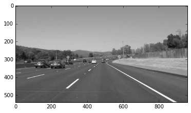
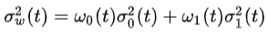
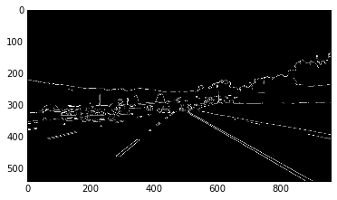
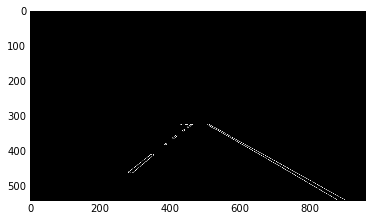
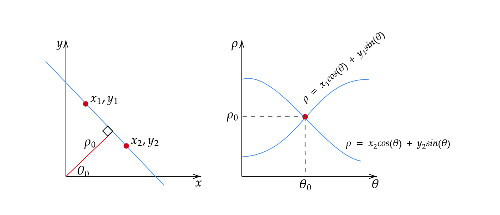
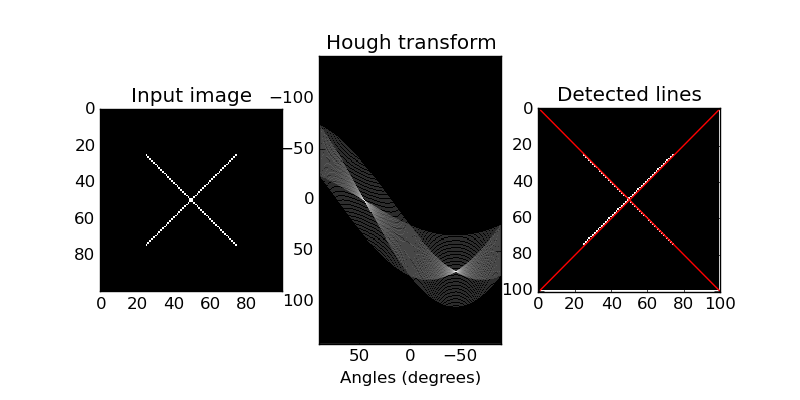
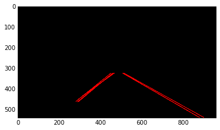
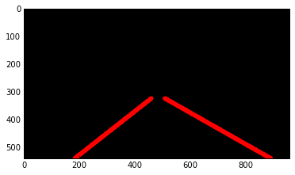
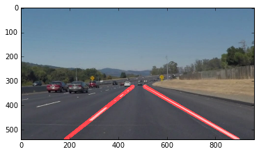

# **Lane Detection** 

   
  <i>Lane detection demo</i>

Overview
---

When we drive, we use our eyes to decide where to go.  The lines on the road that show us where the lanes are act as our constant reference for where to steer the vehicle.  Naturally, one of the first things we would like to do in developing a self-driving car is to automatically detect lane lines using an algorithm.

In this project, lane lines are detected using Python and OpenCV.  

Pipeline
---
The pipeline I used consist of 7 steps.
1. Convert the images to grayscale to reduce the number of channels (save computation power).

  

2. Blur the image using Gaussian blur to remove noise. The width of the mask is chosen to be 5 and the variance is calculated accordingly.

  

3. Thin out the edges using [Canny edge](https://docs.opencv.org/trunk/da/d22/tutorial_py_canny.html) (threshold is determined using [Otsu's method](https://medium.com/@hbyacademic/otsu-thresholding-4337710dc519))
- Otsu's method first created a histogram of the pixel intensities. Then it searches for a threshold that would minimize the variance between the 2 classes separated by the threshold. 

  

- where w represents the class probability (the summartion of the probabilities of all pixels in the class) and sigma represents the class variance.

  

4. Identify Region of Interest (RoI). Later operations are performed only within the RoI to conserve computation power. Upon examination, it seems like a centered trapezoid would identify RoI the best.

  

5. Use [Hough Transform](https://towardsdatascience.com/lines-detection-with-hough-transform-84020b3b1549) to find the lines. This is a lot more efficient and robust to noise than search for line at every possible position/orientation. Time complexity of the former is O(# of lane pixels) vs time complexity of the latter is O(# of lane pixels * # of directions).
- A straight line could be represented by 2 parameters (slope and y-int). However, if the line is vertical, the slope would be inf and this would cause problems. So instead, we use rho and theta to represent a straight line.

  

- A point in cartesian coordinates translates to a sinusoidal curve in hough space. Thus, transforming all points on a line to hough space would lead to many sinusoidal curves. The intersection of the these curves in the hough space corresponds to line in (rho, theta) that define the straight line in cartesian coordinates.

  

- In our case, the result is shown below.

  

6. Separate the lines into 2 groups (left and right lane) and remove outliers in each group, one such algorithm could be [RANSAC](https://medium.com/@iamhatesz/random-sample-consensus-bd2bb7b1be75).

  

7. Overlay the marked lanes on top of original image.

  

Room for improvements (next steps)
---
- The current pipeline is only capable of identifying lanes that are straight. In order to detect curved lanes, I think we would need to fit a polynomial in step 5.
- The RoI is a hard-coded trapezoid, so it would only work when the car is in the middle of the lane. This is enough in most cases. However, we could improve it by scanning the entire view for RoI using a filter and cross-correlation, at the cost of more computation.

Acknowledgement
---
This work is largely based on an [Udacity Autonomous Vehicle class CarND's assignment](https://github.com/udacity/CarND-LaneLines-P1).